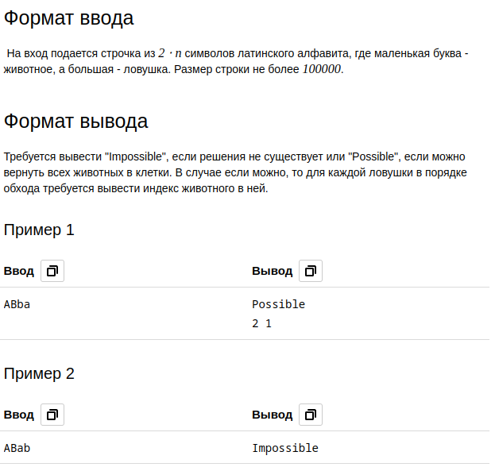
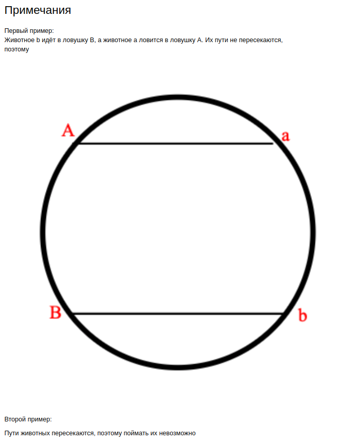

# Зоопарк Глеба

|:-Ограничение времени|1 секунда|
|Ограничение памяти|256Mb|
|Ввод|стандартный ввод или input.txt|
|Вывод|стандартный вывод или output.txt|

Недавно Глеб открыл зоопарк. Он решил построить его в форме круга и, естественно, обнёс забором. Глеб взял вас туда начальником охраны. Казалось бы все началось так хорошо, но именно в вашу первую смену все животные разбежались. В зоопарке n животных различных видов, также под каждый из видов есть свои ловушки. К сожалению некоторые животные враждуют с друг другом в природе (они обозначены разными буквами), а зоопарк обнесён забором и имеет форму круга. С помощью камер, удалось выяснить, где находятся все животные. Умная система поддержки жизнедеятельности зоопарка уже просканировала зоопарк и вывела id всех животных и ловушек в том порядке, в котором они видны из центра зоопарка. Получилось так, что все животные и все ловушки находятся на краю зоопарка. Вы хотите понять, могут ли животные прийти в свою ловушку так, чтобы их путь не пересекался с другими. Если да, также предъявите какую-нибудь из схем поимки животных.

